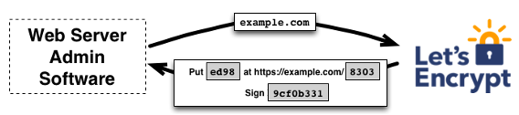
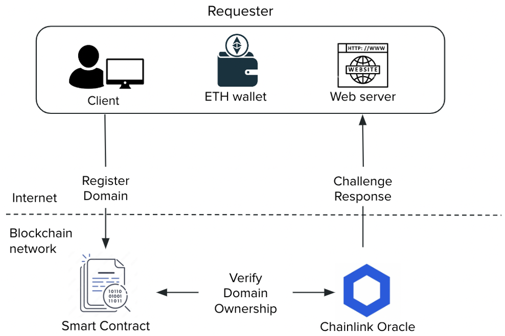
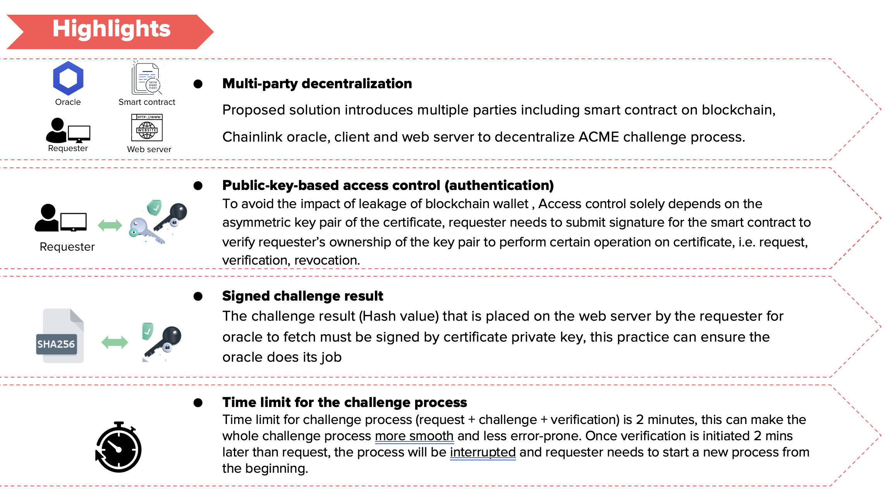
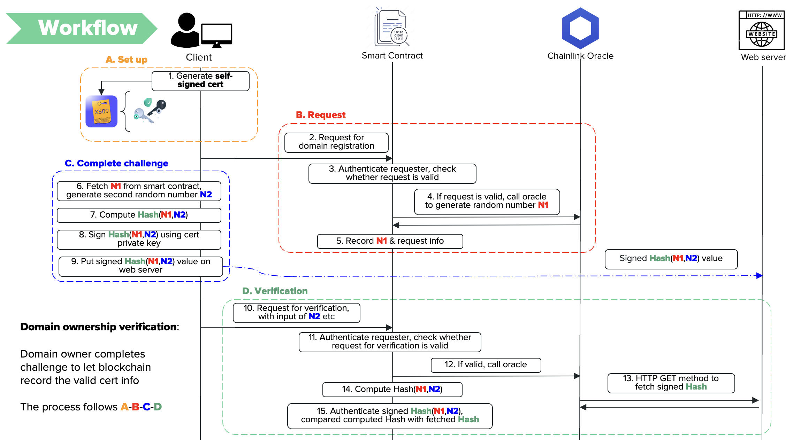
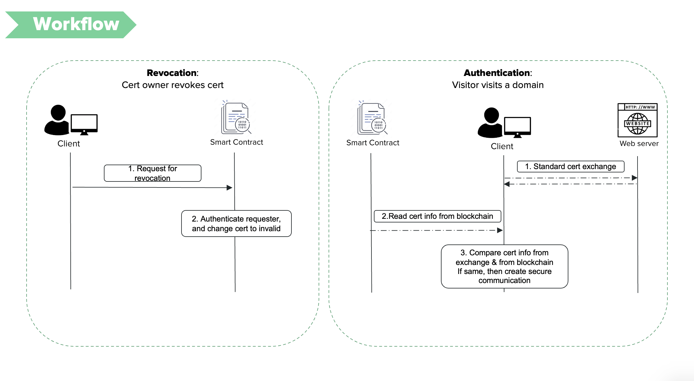

# Decentralized Public Key Infrastructure #
## Automated Certificate Management Environment (ACME) Based on Blockchain ##

### 1. What is ACME
Launched by Let’s Encrypt Certificate Authority, the ACME protocol aims to automate the certificate issuance process in the Public Key Infrastructure. 

The key task of ACME is to verify the requester’s control over the domain (server) through certain challenges. 

The figure below illustrates the typical HTTP challenge:

### 2. Problem of ACME
ACME requires a trusted CA to perform the verification and issuance, and CA is prone to a single point of failure.

Moreover, the whole Let’s Encrypt project is sponsored mainly by U.S.-based companies, as shown below. Potential political centralisation exists. 

### 3. Proposed solution: ACME based on blockchain
Here, we introduce **blockchain technologies** to make the challenge process more **decentralized** and **transparent**.

An **EVM-based smart contract** is designed to function as Let’s Encrypt CA. It handles domain registration requests, verifies domain ownership challenges, and records domain certification info.

Additionally, **Chainlink oracle** is introduced in the solution to decentralize the system further. 

[Summary slides of the project](https://docs.google.com/presentation/d/1gxNX2vuPdBIfc2kgs5ge19j4DT_rVNpm8kgUHHAkEws/edit?usp=sharing)

[Detailed slides of the system design & consideration](https://docs.google.com/presentation/d/19r2J-8IORQFNivCyEdTmVi_kbqb1BZtZZz7iYOtVC6w/edit?usp=sharing)

[Reference research paper](https://gomezgaona.github.io/online-cv/assets/pdfs/a_blockchain-based.pdf)

**Design Highlights:**

**System Workflow:**

